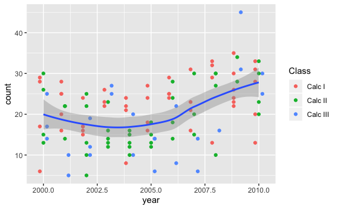
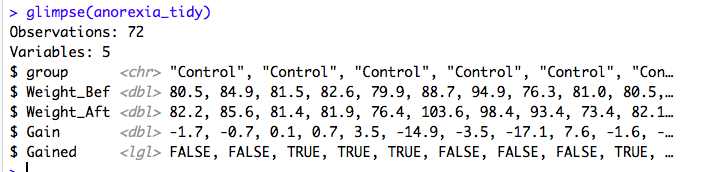

```{r, setup, include=FALSE}
knitr::opts_chunk$set(echo = TRUE)
library(tidyverse)
```

  

**1. Energy Consumption** This problem deals with a dataset containing information on hourly energy consumption data from several electric utilities that are part of the Eastern Interconnection grid in the US. The data are in the file "electric_use.csv" in your data folder.  This dataset was created from data  in the Hourly Energy Consumption Data on Kaggle (https://www.kaggle.com/robikscube/hourly-energy-consumption/home). (Thanks to a previous MATH 295 student for finding this data source for their Dataset-of-the-Day).  

Write a code chunk that does the following:  

a. Reads the data set into a tibble called **electric**.  

b. The data set as provided is not "tidy". Use appropriate functions from this section to make it a tidy data set called **tidy_electric**.  

c. Construct a line plot of hourly consumption data comparing the utilities represented in the data. The line for each utility should be a different color. 


**Answer:**  

```{r}

```

**2. Calc Enrollments** The next task is to read and tidy the data file "calc_enrollments.csv" which contains enrollment in Calculus sections at K over the course of a decade. I was provided this data in an Excel format but have saved them in CSV form for your use.  

Write a code chunk that does the following:  

a. Reads the data set into a tibble called **enrollments**.  

b. The data set as provided is not "tidy". Use appropriate functions from this section to make it a tidy data set called **tidy_enrollments**. Use appropriate arguments to these functions so that there are no NA values and all columns have the correct types. 

c. Construct a point plot of class sizes (y) by year (x) using a different color for each Class (e.g., Calc I, Calc II, ...) and dodging the points so that they don't overlap (that is, for each year, there should be 3 vertical strips of points close together, one for each "Class". Add a single smoothing line that shows the trend in class sizes over all Classes. An example is provided below. (**Note**: I'm sure you could also improve on the x-axis tick marks/labels if you had the time and interest.)



```{r}

```

**3.** The dataset "anorexia_data.txt" contains data from a randomized  experiment carried out to assess the comparative effectiveness of three treatments for anorexia. Details are provided inside the data file. (Source: *A Handbook of Small Data Sets*, Volume 1, by David J. Hand, Fergus Daly, K. McConway, D. Lunn, E. Ostrowski.). The data are formatted exactly as I encountered them. 

Write a code chunk that inputs the data and creates a tidy data set called `anorexia_tidy` that matches the data set shown in the `glimpse()` output below. Here are a few considerations:  

* You should use the interactive "Import Dataset" dialog box we used last time to get a first approximation to the best "read_xyz" command to use. It likely will not be "read_csv()".  

* You may find use for the command `bind_rows()` found on the Data Transformation Cheat Sheet.

* Use "Control", "CogBehav", and "Family" for the three experimental group names.  
* Create two new variables for weight gain as shown in the figure below: one with the actual weight gain and the other that is `TRUE` if the girl gained weight and `FALSE` if her weight stayed the same or decreased.  

* If you still have time, create a plot comparing the weight gains of the three groups.  



```{r}
```


